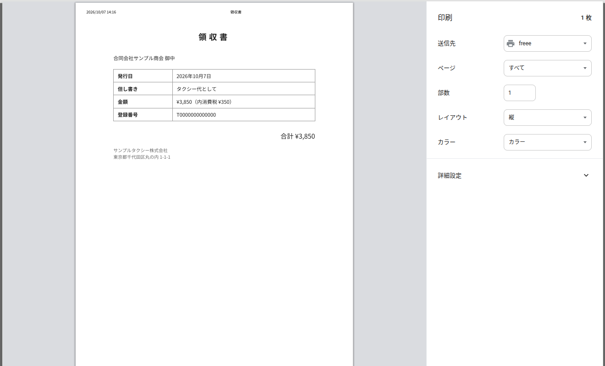
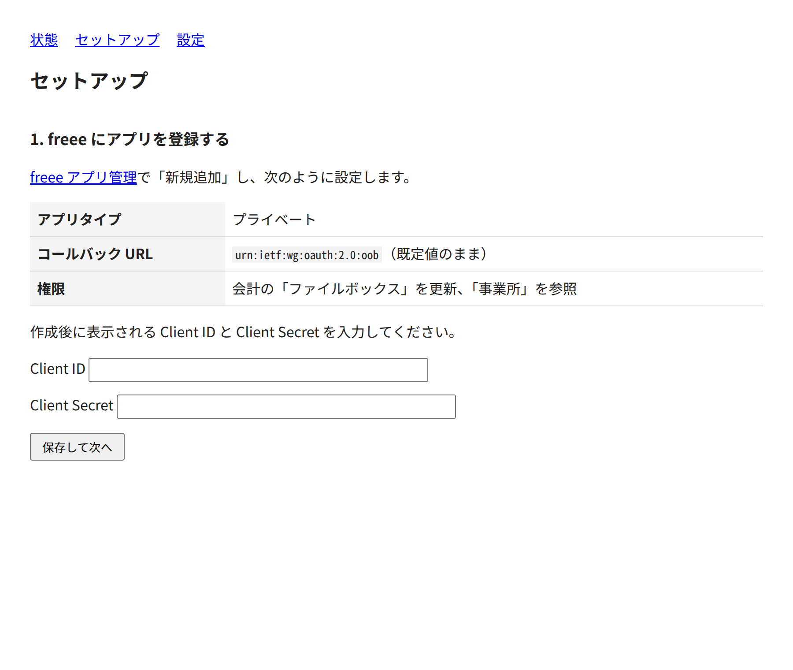
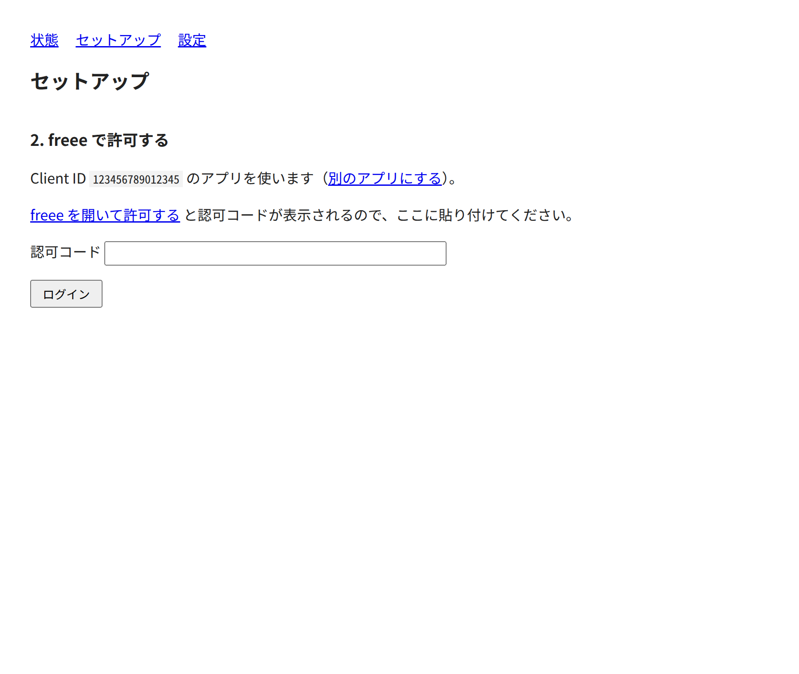
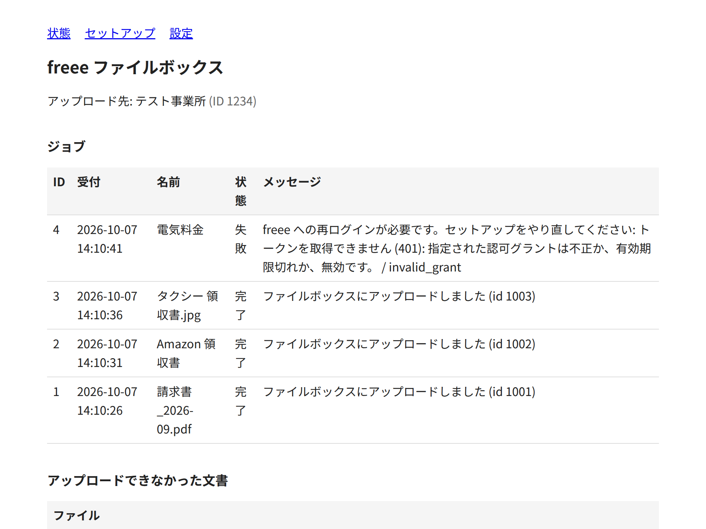
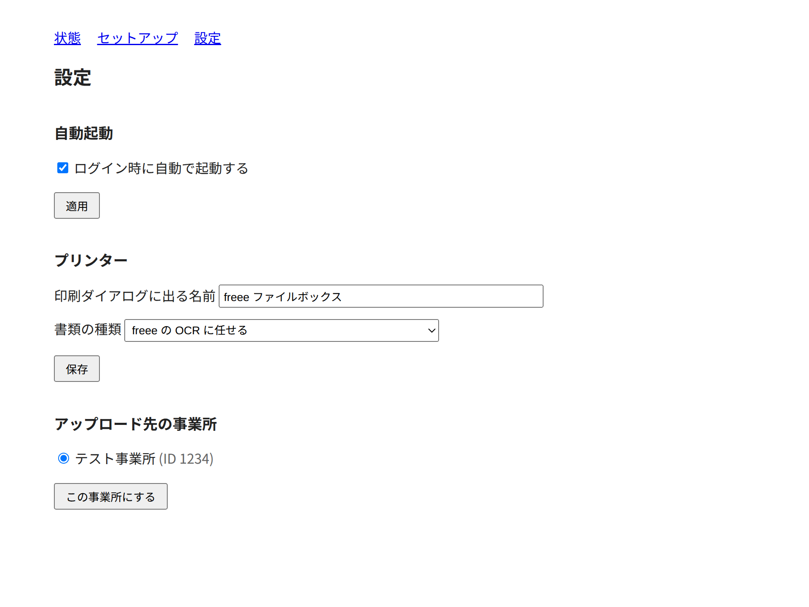

# freee-printer

印刷すると freee 会計のファイルボックスにアップロードされる仮想プリンターです。
どのアプリからでも、印刷ダイアログで「freee」を選ぶだけで、その文書がファイルボックスに入ります。



- Linux、macOS、Windows で動きます。ドライバーは要りません。
- 印刷ジョブの名前（たいていは文書のタイトル）が、ファイル名とメモになります。
- PDF、JPEG、PNG はそのまま、ラスター（iOS や一部の Windows 環境が送る形式）は PDF に変換してアップロードします。
- アップロードできなかった文書は捨てずに保存され、あとから送り直せます。

## 使い始めるまで

全部で 10 分くらいです。freee 会計のアカウントで、アプリ登録ができる権限（管理者）が必要です。

### 1. freee-printer を入れる

[Releases](https://github.com/signal-slot/freee-printer/releases) から、お使いの OS のファイルをダウンロードします。

| OS | ファイル | 入れ方 |
| --- | --- | --- |
| Linux (x86_64) | `freee-printer-linux-x86_64` | `chmod +x` して好きな場所に置く（`~/.local/bin` など） |
| Linux (Raspberry Pi など arm64) | `freee-printer-linux-aarch64` | 同上 |
| macOS (Apple Silicon) | `freee-printer-macos-arm64` | `chmod +x` して好きな場所に置く。初回起動で「開発元を検証できない」と出たら、`xattr -d com.apple.quarantine <ファイル>` を実行するか、Finder で右クリックして「開く」 |
| Windows | `freee-printer-windows-x86_64.exe` | 好きな場所に置く。SmartScreen の警告が出たら「詳細情報」→「実行」 |

バイナリには署名をしていないので、macOS と Windows では初回に警告が出ます。

Rust が入っていれば、ソースから入れることもできます。

```sh
cargo install --git https://github.com/signal-slot/freee-printer freee-printer
```

### 2. 起動する

ターミナルで実行します（Windows なら PowerShell で `.\freee-printer.exe`）。

```sh
freee-printer
```

プリンターが立ち上がり、ブラウザで `http://localhost:7933/` のセットアップ画面が開きます。
開かなければ、手でその URL を開いてください。

### 3. freee にアプリを登録する

セットアップ画面の案内に沿って、[freee アプリ管理](https://app.secure.freee.co.jp/developers/applications)で自分用のアプリを作ります。



1. 「新規追加」でアプリを作ります。名前は何でも構いません（例: freee-printer）。
2. アプリタイプは「プライベート」にします。
3. コールバック URL は既定値（`urn:ietf:wg:oauth:2.0:oob`）のままにします。
4. 権限は、会計の「ファイルボックス」を更新、「事業所」を参照、の 2 つを付けます。
5. 作成後に表示される Client ID と Client Secret を、セットアップ画面に貼り付けて「保存して次へ」。

自分でアプリを登録する必要があるのは、freee の OAuth が Client Secret を必須にしているためです。
配布するプログラムに Secret を同梱すると公開したのと同じになるので、使う人ごとに登録してもらっています。

### 4. freee で許可する



「freee を開いて許可する」を押すと freee の許可画面が開きます。
許可すると認可コードが表示されるので、コピーしてセットアップ画面に貼り付け、「ログイン」を押します。
事業所が複数あれば、どこにアップロードするかを選びます。

### 5. プリンターとして登録する

ターミナルに戻ると、このマシンの印刷ダイアログにプリンターを追加するか聞いてきます。

```text
プリンター「freee ファイルボックス」が動いています。状態と設定: http://localhost:7933/
このマシンの印刷ダイアログに「freee」を追加しますか? [Y/n]
追加しました。印刷ダイアログで「freee」を選ぶと、ファイルボックスにアップロードされます。
```

Enter を押せば登録されます。
Linux では管理者権限が要ることがあり、そのときは `sudo` のパスワードを聞かれます。
Windows では「変更を許可しますか」の確認（UAC）が出るので「はい」を選びます。

### 6. 印刷してみる

何かのアプリで印刷ダイアログを開き、「freee」を選んで印刷します。
数秒で freee のファイルボックスに入ります。
`http://localhost:7933/` の状態ページで、ジョブごとの結果を確認できます。



### 7. 自動で起動するようにする

毎回ターミナルで起動するのは面倒なので、設定ページ（`http://localhost:7933/settings`）で「ログイン時に自動で起動する」を入れて「適用」を押します。
今動いているプロセスは終了し、以後はログインのたびに裏で起動します。



| OS | 仕組み |
| --- | --- |
| Linux | systemd のユーザーサービス。ログは `journalctl --user -u freee-printer -f`。ログインしていない間も動かすなら `loginctl enable-linger` |
| macOS | launchd のエージェント。ログは `~/Library/Logs/freee-printer.log` |
| Windows | レジストリの Run キー。ウィンドウは出ません |

登録されるのは「今動かしているファイル」なので、あとでバイナリを移動したら、設定ページで自動起動を切って入れ直してください。

## 困ったとき

**印刷ダイアログに「freee」が出ない**
freee-printer を起動した状態で `freee-printer install` を実行してください。
ターミナルの問いに「n」と答えた場合や、自動起動のサービスだけで動かしている場合は、これで登録できます。

**印刷したのにファイルボックスに入らない**
状態ページ（`http://localhost:7933/`）のジョブ一覧に理由が出ます。
よくあるのは次の 3 つです。

- アップロード先の事業所が違う: 設定ページで事業所を切り替えてください。
- freee への再ログインが必要: freee のトークンは 90 日で失効します。セットアップページからログインし直してください。
- 一時的な通信エラー: 3 回まで自動で再試行します。駄目だった文書は状態ページに残るので、「送り直す」を押してください。

**macOS で「開発元を検証できない」と言われる**
署名をしていないためです。`xattr -d com.apple.quarantine <ファイル>` を実行するか、Finder で右クリックして「開く」を選んでください。

**Windows で SmartScreen の警告が出る**
同じく署名をしていないためです。「詳細情報」→「実行」で進めます。

**ポート 7933 が使えないと言われる**
別の freee-printer が動いています。自動起動を登録したあとに手でも起動した場合によく起きます。
`freee-printer status` で状況を確認し、片方を止めてください。

**やめたいとき**
`freee-printer uninstall` でプリンターの登録を外し、`freee-printer service uninstall` で自動起動を外します。
設定とトークンは `~/.config/freee/credentials`（Windows は `%APPDATA%\freee\credentials`）にあります。
freee 側では、アプリ管理からアプリを削除すればトークンも無効になります。

## 設定ページでできること

`http://localhost:7933/` の各ページです。

- **状態**: アップロード先の事業所、ジョブの一覧と失敗理由、アップロードできなかった文書の送り直しと削除。
- **セットアップ**: freee へのログイン。別のアプリに切り替えることもできます。
- **設定**: ログイン時の自動起動、印刷ダイアログに出る名前、書類の種類（領収書 / 請求書 / その他 / freee の OCR に任せる）、事業所の切り替え。

セットアップと設定、送り直しは、このマシン（localhost）からの接続にだけ応じます。
LAN に開けたとき（後述）に他の端末から見えるのは状態だけです。

## 他の端末から使う

```sh
freee-printer serve --listen 0.0.0.0:7933 --advertise
```

同じ LAN の PC やスマートフォンのプリンター一覧に「freee ファイルボックス」が現れます。
認証はないので、このアドレスに届く人は誰でもファイルボックスにアップロードできます。
信頼できるネットワークでだけ使ってください。

## コマンド一覧

| コマンド | 内容 |
| --- | --- |
| `freee-printer` | 起動する。未ログインならセットアップ画面を開く |
| `freee-printer serve` | プリンターとして動かす（`--listen`、`--advertise` を指定するとき） |
| `freee-printer install` / `uninstall` | この OS の印刷ダイアログにプリンター「freee」を登録する / 外す |
| `freee-printer service install` / `service uninstall` | ログイン時の自動起動を登録する / 外す |
| `freee-printer login` | freee へのログインをターミナルで行う |
| `freee-printer company [ID]` | アップロード先の事業所を選び直す |
| `freee-printer upload <file>...` | 印刷せずにファイルを直接アップロードする |
| `freee-printer status` | 設定とログイン状態を表示する |

`upload` は、プリンターが動いている最中でも使えます。

## 設定ファイル

状態は `~/.config/freee/credentials` に `KEY=値` の形で入ります（Windows は `%APPDATA%\freee\credentials`、正確な場所は `freee-printer status` が表示します）。
freee の Client Secret とトークンを含むので、所有者だけが読める権限で保存されます。

このファイルは、シェルスクリプトが `source` できる形式にしてあり、freee の API を使う他のツールと共有できます。
すでに `CLIENT_ID`、`CLIENT_SECRET`、`ACCESS_TOKEN`、`REFRESH_TOKEN`、`COMPANY_ID` が書かれていれば、そのまま使うので登録もログインも要りません。
トークンの更新はファイルロックの下で行い、更新後のトークンはその場で書き戻します。
ただし、他のツールが同時にトークンを更新すると、どちらかの更新が失敗します（freee のリフレッシュトークンは一度しか使えません）。

設定ページで変えられる項目は、手で書いても構いません。

| キー | 内容 |
| --- | --- |
| `pr_name` | 印刷ダイアログに出る名前（既定: freee ファイルボックス） |
| `pr_doc_type` | `receipt` / `invoice` / `other`。省略時は freee の OCR 任せ |
| `COMPANY_NAME` | 表示用の事業所名 |

## 制限

- 部数、ページ範囲、両面などの印刷オプションは無視します。
- ファイルボックスの上限により、1 ファイル 64 MB までです。
- アップロードが始まったジョブは取り消せません。
- iOS と Android からの印刷は試していません。

## 開発者向け

### 検証状況

確認済み:

- Linux: CUPS に登録したプリンター「freee」からのテストページ印刷と、本物の freee ファイルボックスへのアップロード
  （日本語のジョブ名がそのままファイル名になる）。
- macOS 26（arm64、VM）: `cargo install`、管理者ユーザーでの `sudo` なしの `lpadmin` 登録、`lp` での印刷、
  launchd エージェント（登録、解除、設定ページからの引き継ぎ）。freee はモックサーバー。
- Windows 11（VM）: MSVC Build Tools での `cargo install`、UAC 経由で昇格した `Add-Printer -IppURL`
  （Microsoft IPP Class Driver のキューになり、PDF で送ってくる）、`Out-Printer` での印刷、Run キーのサービス。
  freee はモックサーバー。
- Linux でモックサーバー相手に: `ipptool` の IPP 1.1 / 2.0 テスト、PDF・JPEG・ラスター、Create-Job + Send-Document、
  gzip、トークン更新、アップロードの再試行、失敗した文書の保存と送り直し、`serve` 実行中の `upload`。

### 仕組み

IPP Everywhere のプリンターとして振る舞い、受け取った文書を `POST /api/1/receipts` でアップロードします。

```text
印刷する端末 ──IPP──▶ freee-printer ──HTTPS──▶ freee ファイルボックス
```

| 受け取る形式 | アップロードされる形式 |
| --- | --- |
| PDF | そのまま |
| JPEG / PNG | そのまま |
| PWG Raster / Apple Raster (URF) | 1 ページ 1 画像の PDF に変換（300 dpi） |

### 構成

| パス | 役割 |
| --- | --- |
| `crates/core` | プリンター本体。IPP、HTTP/1.1、ラスター変換、freee API、Web ページ、ログイン手順。スレッドとブロッキング I/O だけで書いてあり、通信と保存は trait 越しなので、専用ハードウェアのファームウェアにも載せられる作りにしてある。 |
| `cli` | Linux / macOS / Windows 用のコマンド。rustls の TLS、認証情報ファイル、DNS-SD、OS への登録。 |

```sh
cargo run                # 開発中の起動
cargo test               # テスト
cargo install --path cli # 手元に入れる
```
